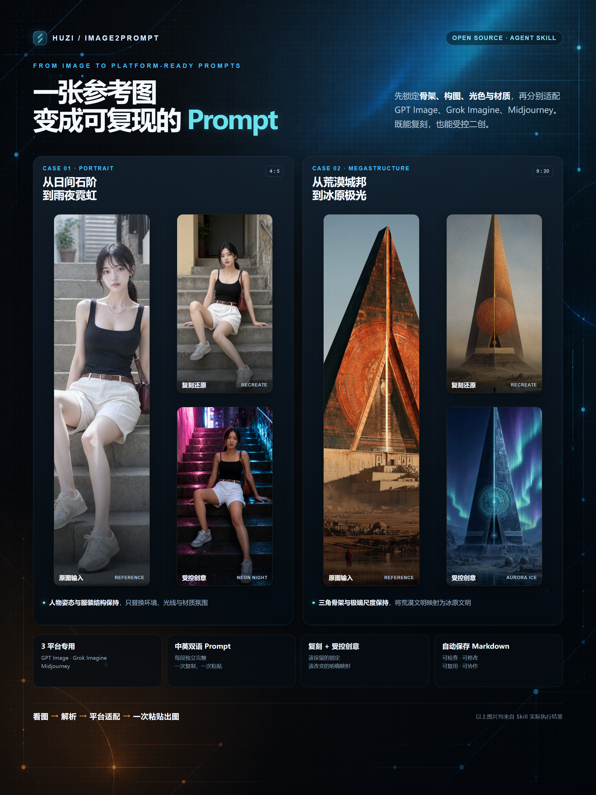

# Huzi Image2Prompt

`huzi-image2prompt` 是一个开源 Agent Skill。它读取参考图，提取可见的主体、结构、构图、光色、材质和文字信息，再生成可直接用于 GPT Image、Grok Imagine、Midjourney 的中英文平台专用 Prompt，并将结果保存为 Markdown 文件。默认为复刻模式（零漂移复现）；也可以基于解析结果做受控创意创作：按继承/变换/放开声明控制维度，让画面只在指定维度有意变化。

## 适用场景

- **看到好看的图片想复刻，但是没有提示词**：上传参考图，自动拆解主体、结构、构图、光色和材质，生成可直接用于 GPT Image、Grok Imagine、Midjourney 的中英文 Prompt。
- **想保留原图核心元素，同时进行可控二创**：指定需要改变的场景、时间、色彩或风格，锁定人物姿态、主体骨架和空间关系，让画面只在选定维度发生变化。



## 快速开始

### 运行条件

- 支持 `SKILL.md` 的 Agent 运行时
- 能读取用户附件、本地图片或图片 URL 的视觉能力
- 能在当前工作目录创建 Markdown 文件并复制原图

技能本身没有第三方运行时依赖，也不包含网络请求、遥测或密钥。

### 安装

任选一种方式：

1. 将 [`huzi-image2prompt/`](huzi-image2prompt/) 复制到宿主的技能目录。
2. 在支持 `.skill` 包导入的运行时中安装 [`dist/huzi-image2prompt.skill`](dist/huzi-image2prompt.skill)。

常见目录示例：

```text
Codex:       $CODEX_HOME/skills/huzi-image2prompt/
Claude Code: ~/.claude/skills/huzi-image2prompt/
```

### 触发

上传图片或提供可访问路径，然后发送类似指令：

- `解析图片`
- `获取这个图片的 Prompt`
- `反推这张图的提示词`
- `只要 Grok 中文 Prompt`
- `基于这张图做创意，换成雪夜`（创意模式：给出方向直接创作）
- `帮我基于这张图做点创意`（创意模式：先给 3 个候选方向供选择）

指令不含模式信号时（如只说“解析图片”），读图后、生成前会询问一次模式：复刻还原（默认）、创意创作·提 3 个方向、创意创作·自述方向；含明确信号（如“反推”“创意”）时直接执行，不再询问。

若图片不存在、损坏、无权限或无法解码，技能会说明阻塞原因，不会编造图片内容或创建占位文件。

## 默认输出

未指定保存位置时，每张图片生成一份独立 Markdown，并在同级 `assets/` 中保存原图副本：

```text
.huzi-image2prompt/
  <名称基名>-prompts-<YYYYMMDD-HHmmss-fff>.md
  assets/
    <名称基名>-source-<YYYYMMDD-HHmmss-fff>.<扩展名>
```

名称基名取可读的原图文件名；粘贴图、截图等机器名（如 `mmexport…`、UUID、`image (37)`）不进入输出文件名，改用从解析结果提炼的中文语义短语（如 `黄雨衣男孩雨夜巷道`），原始文件名完整保留在 Markdown 元数据中。

每份 Markdown 包含：

- 来源元数据（原图名称、精确原始尺寸、规范化生成比例）
- 原图预览（相对路径引用 `assets/` 副本，移动整个目录仍可预览）
- “图片解析结果”章节（画面事实与必须保持要点）
- 三个平台的中英文共六段可独立复制的 Prompt，每段自带正向描述和反义约束，无需另拼 Negative Prompt

| 平台 | 语言 |
|---|---|
| GPT Image | 中文、English |
| Grok Imagine | 中文、English |
| Midjourney | 中文、English |

用户指定目录或文件名时优先使用；明确限制平台或语言时，只生成所需范围。写入成功后，控制台只返回实际 Markdown 路径，不重复打印 Prompt。

## 与直接使用参考图的区别

| 方式 | 优点 | 缺点 |
|---|---|---|
| 直接使用参考图 | 操作简单；更容易保留人物身份、构图和整体风格 | 控制过程不可见；跨平台表现不稳定；生成偏差较难定位 |
| 使用本项目生成 Prompt | 视觉要求可检查、修改和保存；便于跨平台复用、受控二创、团队协作和逐项纠偏 | 图片转为文字时会损失部分细节；单靠 Prompt 不适合精确身份或像素级复现 |

需要较高还原度时，建议同时使用原始参考图和本项目生成的 Prompt：参考图负责视觉锚定，Prompt 负责明确需要保留或改变的内容。

## 项目结构

```text
huzi-image2prompt/
  SKILL.md                       技能契约和完整工作流
  references/
    reconstruction-method.md     结构测量、门禁、评分和迭代规则
    model-adapters.md            视觉事实规范与三平台 adapter
evals/                           行为回归用例与结果
demo/assets/                     公开演示图片
dist/huzi-image2prompt.skill     可安装包
```

行为细节（重建顺序、色彩保真、比例规范化、平台差异等）以 `SKILL.md` 和 `references/` 为准，此处不再展开。

## 局限

- 只能重建成图中可见的视觉特征，无法恢复原始模型、种子、采样器等生成参数。
- 复现质量受宿主视觉分析能力和目标生成模型能力影响；精确输出像素由平台自身控制。

## 隐私

成功输出时会在 `assets/` 中额外保存一份原图副本，请按原图相同的敏感级别管理该目录。

## 许可证

MIT，详见 [`LICENSE`](LICENSE)。
